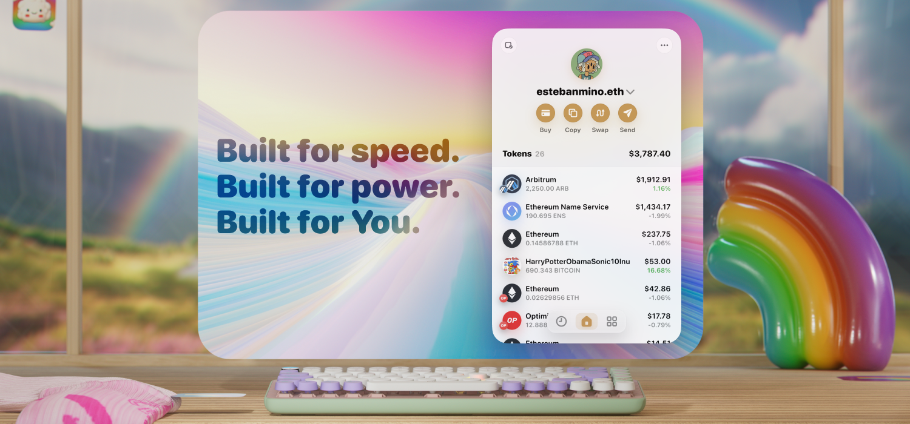

## 🌈️ Rainbow Extension

Built for speed. Built for power. Built for you.

Rainbow is a fun, simple, and secure Ethereum wallet that makes managing your assets a joy. Great for newcomers and power users alike, Rainbow allows you to be in total control of your crypto. You own your assets directly thanks to the power of cryptography and the Ethereum blockchain, and Rainbow makes managing all of your wallets and keys a breeze.

### Features
- Auto-discovers tokens and assets
- Supports Layer 2 chains like Arbitrum, Optimism, Base, Polygon, Avalanche, & Zora right out-of-the-box
- Built-in Send, Bridge, and Swap to power all of your DeFi needs
- Keyboard shortcuts for pros to switch wallets like 1  2  3
- Search and navigate your wallets with ⌘K or Ctrl-K for the Magic Menu
- Watch wallets and interact with dApps in Impersonation mode

...and a lot more.

### Available today for


[Chromium](https://chrome.google.com/webstore/detail/rainbow/opfgelmcmbiajamepnmloijbpoleiama) including Chrome, Brave and Arc


[Edge](https://chrome.google.com/webstore/detail/opfgelmcmbiajamepnmloijbpoleiama)


[Firefox](https://addons.mozilla.org/en-US/firefox/addon/rainbow-extension/)


Safari is [coming soon](https://rainbowdotme.typeform.com/to/iT919yeN)

## Security architecture

Rainbow is one of the first extensions to use the new Manifest v3 extension standard. This comes with some important security benefits:
- **Runtime isolation**: Remotely hosted code is no longer allowed; an extension can only execute JavaScript that is included within its package.
- **Network firewall**: Content security policy (CSP) allows us to define which domains the extension can interact with, similar to a "firewall". This means that if at any point the extension is compromised, it will not be able to communicate with any domain that is not explicitly allowed in the CSP, preventing any kind of data exfiltration.

The v3 standard also improves the overall reliability of Rainbow:
- **Performance**: lighter CPU and memory footprint - the extension consumes resources only when active thanks to service workers. You can compare how quickly the extension loads compared to others.
- **Reliable hardware wallets**: The extension can directly access web technologies like WebUSB and HID that make the integration with hardware wallets much simpler and more secure.

Additionally, we're using some well known tools engineered by the MetaMask team:
 - [@lavamoat/allow-scripts](https://github.com/LavaMoat/LavaMoat/tree/main/packages/allow-scripts) and [@lavamoat/preinstall-always-fail](https://github.com/LavaMoat/LavaMoat/tree/main/packages/preinstall-always-fail) are used to disable or allow dependency lifecycle scripts (eg. "postinstall"), a common build-time vulnerability
 - [lavamoat](https://github.com/LavaMoat/lavamoat) aka LavaMoat Node is a NodeJS runtime that protects our build process, which aims to reduce the risk of malicious code in the dependency graph, commonly known as "software supply chain attacks"
- [browser-passworder](https://github.com/MetaMask/browser-passworder) is our shared encryption library used to encrypt a user's keychain while at rest

> NOTE: We don't rely on LavaMoat at runtime because of the performance overhead and the benefits we already receive from Manifest v3, but we may consider it in the future.

## Getting started

### Prerequisites

- [Yarn](https://classic.yarnpkg.com/en/docs/install)
- [nvm](https://github.com/nvm-sh/nvm)

### 1. Set up Node

Use node v18 or if you use nvm follow the instructions below

```bash
nvm install
# or
nvm use
```

### 2. Install project dependencies

```bash
yarn setup
```

### 3. Set up your .env file

Run `touch .env`, head to the `browser-extension-env` repository, and copy + paste the variables into your `.env`

### 4. Install the ["Extensions Reloader" extension](https://chrome.google.com/webstore/detail/extensions-reloader/fimgfedafeadlieiabdeeaodndnlbhid?hl=en)

This extension will force reload the extension (webpack should do this automatically, but you can use this extension as a last resort).

## Importing the extension

### 1. Build the extension

```bash
yarn build
```

### 2. Enable Developer Mode in Chrome

Go to `chrome://extensions/` and enable `Developer mode`.

### 3. Import the extension

Click on `Load unpacked` and select the `build` folder.

## Development

### 1. Start the development build

Run `yarn dev` to build your changes in "watch" mode.

### 2. Make changes to the code

Any changes to your code will trigger an update to the extension.

> Tip: You can press Option + Shift + R to reload the extension (on Mac) or Ctrl + Shift + R (on Windows) - This is done via the extension reloader chrome extension from the step 4 of the setup scenario.

## Playgrounds

You can run a development build as a "playground". The following playgrounds are available:

- `yarn playground` **(Default)**: A generic playground to test out stuff.
- `yarn playground:ds` **(Design System)**: A playground to view & demo Design System components.

## Testing

### 1. Install foundry

Run `curl -L https://foundry.paradigm.xyz | bash` to install foundry.
You'll need to restart the terminal.

### 2. Run the tests

To run the Browser Extension test suites:

- `yarn e2e` – runs end-to-end tests against Chrome for Testing browser.
- `yarn test` – runs unit/integration tests.
  - `yarn test:watch` – run tests in watch mode.

## License

[GPL-3.0](/LICENSE) License
