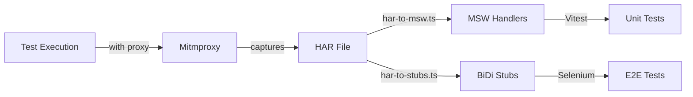

# New E2E Testing Architecture - HAR-Based Mock System

## Overview

This document describes the new HAR-based mock system that replaces the previous runtime injection approach. The new system provides clean separation between test infrastructure and production code, with automatic mock recording and replay capabilities.

## Key Improvements

### Before (Old System)

- ❌ Mock code bundled into production via `IS_TESTING` flag
- ❌ Runtime fetch interception inside the extension
- ❌ Manual mock generation with custom scripts
- ❌ Hash-based file matching prone to misses
- ❌ No fail-fast for unmocked requests

### After (New System)

- ✅ Zero production code pollution
- ✅ Network interception at browser/proxy level
- ✅ Automatic HAR recording via mitmproxy
- ✅ Single source of truth (HAR files)
- ✅ Fail-fast mode for unmocked requests

## Architecture Components

### 1. HAR Recording & Conversion

#### Scripts

```
scripts/
├── har-to-msw.ts      # Converts HAR → MSW handlers for Vitest
├── har-to-stubs.ts    # Converts HAR → BiDi stubs for Selenium
└── har_dump.py        # Mitmproxy addon for HAR recording
```

#### Flow

1. **Record**: Tests run with proxy, traffic captured to HAR
2. **Convert**: HAR files transformed to appropriate format
3. **Replay**: Mocks served via MSW (Vitest) or BiDi (Selenium)

### 2. Proxy Recording System

#### ProxyRecorder Class (`e2e/helpers/proxyRecorder.ts`)

```typescript
class ProxyRecorder {
  constructor(
    scenarioName: string,
    options?: {
      mode?: 'record' | 'replay' | 'passthrough';
      updateMocks?: boolean;
      failOnUnmocked?: boolean;
    },
  );

  async start(): Promise<void>;
  async stop(): Promise<void>;
}
```

**Features:**

- Automatic mitmproxy management
- HAR file generation
- Mock conversion pipeline
- Graceful fallback if mitmproxy unavailable

### 3. Network Interception

#### For Selenium Tests (BiDi)

```typescript
// e2e/bidiStubServer.ts
class BiDiStubServer {
  constructor(
    driver: WebDriver,
    options?: {
      stubsDir?: string;
      failOnUnmocked?: boolean;
    },
  );

  async start(): Promise<void>; // Intercepts via CDP
  async stop(): Promise<void>; // Cleanup
}
```

**How it works:**

- Uses Chrome DevTools Protocol (CDP) for network interception
- Loads stubs from JSON files generated from HAR
- Responds with mocked data or fails/continues based on config

#### For Vitest Tests (MSW)

```typescript
// tests/msw.setup.ts
import { setupServer } from 'msw/node';

// Automatic setup for all tests
beforeAll(() => server.listen({ onUnhandledRequest: 'error' }));
afterEach(() => server.resetHandlers());
afterAll(() => server.close());
```

### 4. WebDriver Configuration Updates

```typescript
// e2e/helpers.ts - Updated initDriverWithOptions
const options = new chrome.Options();
options.set('goog:chromeOptions', {
  args: [
    '--proxy-server=http://localhost:8080', // Route through proxy
    '--proxy-bypass-list=<-loopback>,127.0.0.1,localhost',
  ],
});
```

## Usage Patterns

### Recording New Mocks

```bash
# 1. Install mitmproxy (optional but recommended)
pip install mitmproxy

# 2. Run tests with recording enabled
UPDATE_MOCKS=true yarn vitest run e2e/serial/swap/1_swapFlow1.test.ts

# 3. HAR files automatically generated and converted
```

### Test Implementation

```typescript
import { ProxyRecorder } from '../helpers/proxyRecorder';
import { BiDiStubServer } from '../bidiStubServer';

describe('Swap Flow', () => {
  let recorder: ProxyRecorder;
  let stubServer: BiDiStubServer;
  let driver: WebDriver;

  beforeAll(async () => {
    // Initialize driver
    driver = await initDriverWithOptions({ browser: 'chrome', os: 'mac' });

    // Setup recording/replay
    recorder = new ProxyRecorder('swap-flow', {
      mode: process.env.UPDATE_MOCKS ? 'record' : 'replay',
      failOnUnmocked: true,
    });
    await recorder.start();

    // Setup BiDi interception
    stubServer = new BiDiStubServer(driver, {
      stubsDir: path.join(__dirname, '../stubs/swap-flow'),
      failOnUnmocked: true,
    });
    await stubServer.start();
  });

  afterAll(async () => {
    await stubServer.stop();
    await recorder.stop();
    await driver.quit();
  });

  test('should execute swap', async () => {
    // Test implementation
  });
});
```

## File Structure

```
e2e/
├── har/                    # Recorded HAR files
│   └── [scenario].har
├── stubs/                  # Generated BiDi stubs
│   └── [scenario]/
│       └── stubs.json
├── mocks/                  # Generated MSW handlers
│   └── [scenario].handlers.ts
├── helpers/
│   └── proxyRecorder.ts   # Proxy management
├── bidiStubServer.ts      # BiDi network interception
└── examples/
    └── auto-mock-test.example.ts  # Usage examples

tests/
├── msw.setup.ts           # MSW configuration
└── mocks/
    └── [scenario].handlers.ts
```

## Mock Data Flow



## Migration Path

### Phase 1: Setup Infrastructure ✅

- Created HAR conversion scripts
- Implemented ProxyRecorder class
- Built BiDiStubServer
- Configured MSW for Vitest

### Phase 2: Remove Old System ✅

- Removed `mockFetch()` from production code
- Cleaned up `IS_TESTING` conditionals
- Deleted runtime injection logic

### Phase 3: Test Migration (Current)

1. Run tests with `failOnUnmocked: false` to identify gaps
2. Record HAR files for each test scenario
3. Generate and verify stubs
4. Enable `failOnUnmocked: true` progressively
5. Remove old mock files once validated

### Phase 4: Cleanup (Pending)

- Delete `e2e/mockFetch.ts`
- Delete `e2e/generateUserAssetMocks.ts`
- Remove `e2e/mocks/*.json` files
- Update CI/CD pipelines

## Benefits

### Developer Experience

- **Automatic Recording**: No manual mock creation
- **Easy Updates**: `UPDATE_MOCKS=true` refreshes all mocks
- **Better Debugging**: HAR files are human-readable
- **Fail Fast**: Immediate feedback on unmocked calls

### Code Quality

- **Clean Separation**: Test code stays in test environment
- **No Production Impact**: Zero runtime overhead
- **Type Safety**: Generated handlers include TypeScript types
- **Single Source of Truth**: HAR defines all mock behavior

### Reliability

- **Deterministic**: Same HAR = same test results
- **Complete Coverage**: All network calls captured
- **Version Control**: HAR files tracked in git
- **CI/CD Ready**: No external dependencies required

## Configuration Options

### Environment Variables

- `UPDATE_MOCKS`: Enable HAR recording mode
- `FAIL_ON_UNMOCKED`: Fail tests on unmocked requests
- `PROXY_PORT`: Custom proxy port (default: 8080)
- `HAR_DIR`: HAR file directory (default: e2e/har)

### ProxyRecorder Options

```typescript
{
  mode: 'record' | 'replay' | 'passthrough',
  updateMocks: boolean,      // Auto-update existing mocks
  failOnUnmocked: boolean,   // Fail on unmocked requests
  port: number,              // Proxy port
  harDir: string,           // HAR output directory
}
```

### BiDiStubServer Options

```typescript
{
  stubsDir: string,         // Stub files directory
  failOnUnmocked: boolean,  // Fail on unmocked requests
  logLevel: 'debug' | 'info' | 'warn' | 'error',
}
```

## Troubleshooting

### Common Issues

1. **Mitmproxy not found**
   - Solution: `pip install mitmproxy` or run with `mode: 'passthrough'`

2. **Proxy connection refused**
   - Check port 8080 availability
   - Verify Chrome proxy settings

3. **BiDi connection failed**
   - Ensure Chrome started with `--remote-debugging-port`
   - Check CDP connection

4. **Stubs not loading**
   - Verify stub file paths
   - Check JSON validity
   - Enable debug logging

## Next Steps

1. **Complete test migration** - Update all tests to use new system
2. **CI/CD integration** - Update GitHub Actions workflows
3. **Documentation** - Create developer guides
4. **Performance optimization** - Implement stub caching
5. **Cross-browser support** - Extend to Firefox/Safari

## Resources

- [HAR 1.2 Specification](http://www.softwareishard.com/blog/har-12-spec/)
- [MSW Documentation](https://mswjs.io/)
- [Chrome DevTools Protocol](https://chromedevtools.github.io/devtools-protocol/)
- [Mitmproxy Documentation](https://docs.mitmproxy.org/)